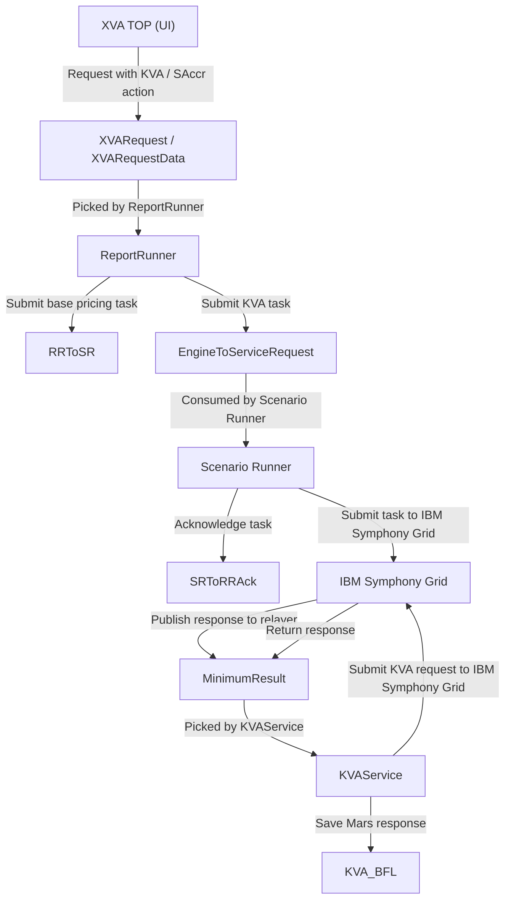
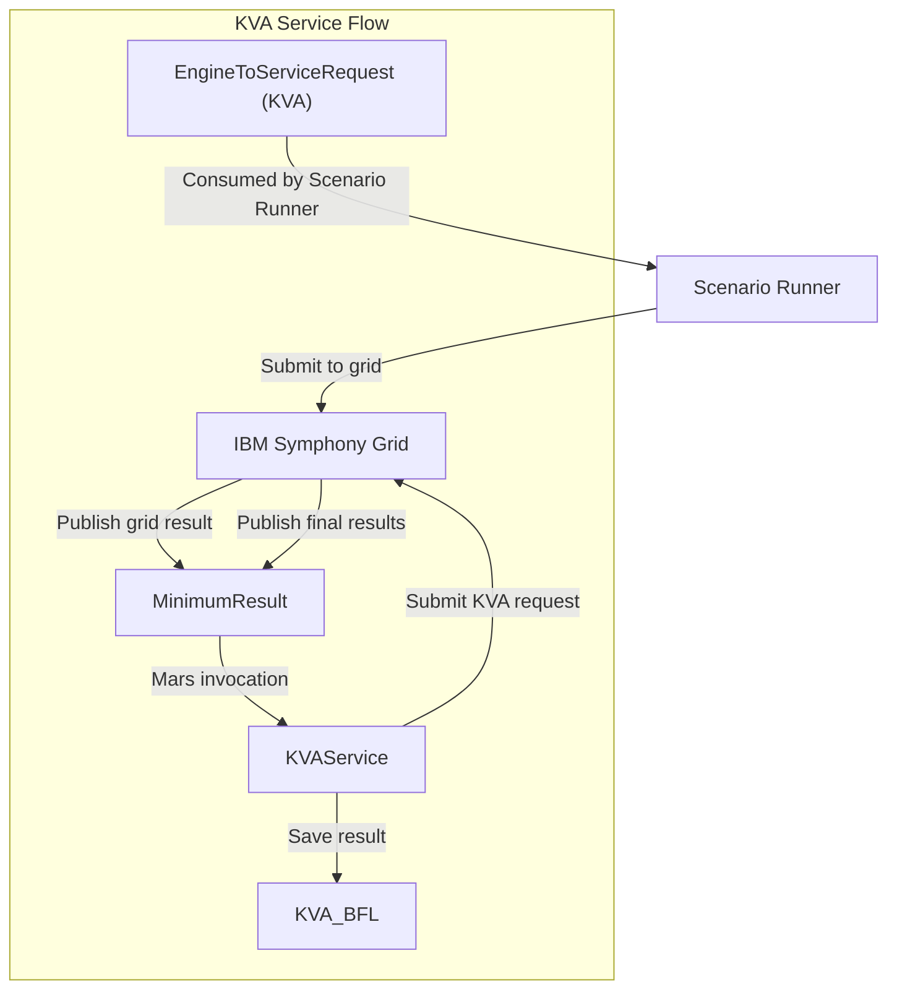

```mermaid
flowchart TD
  UI["XVA TOP (UI)"] -->|Request with KVA / SAccr action| XVARequest["XVARequest / XVARequestData"]
  XVARequest -->|Picked by ReportRunner| ReportRunner["ReportRunner"]
  ReportRunner -->|Submit base pricing task| RRToSR["RRToSR"]
  ReportRunner -->|Submit KVA task| EngineToService["EngineToServiceRequest"]
  EngineToService -->|Consumed by Scenario Runner| ScenarioRunner["Scenario Runner"]
  ScenarioRunner -->|Acknowledge task| SRToRRAck["SRToRRAck"]
  ScenarioRunner -->|Submit task to IBM Symphony Grid| IBMGrid["IBM Symphony Grid"]
  IBMGrid -->|Publish response to relayer| MinimumResult["MinimumResult"]
  MinimumResult -->|Picked by KVAService| KVAService["KVAService"]
  KVAService -->|Save Mars response| KVA_BFL["KVA_BFL"]
  KVAService -->|Submit KVA request to IBM Symphony Grid| IBMGrid
  IBMGrid -->|Return response| MinimumResult
```

```mermaid
flowchart TD
  subgraph KVA Service Flow
    KVARequest["EngineToServiceRequest (KVA)"]
    KVAService["KVAService"]
    IBMGrid["IBM Symphony Grid"]
    MinimumResult["MinimumResult"]
    KVA_BFL["KVA_BFL"]
  end

  KVARequest -->|Consumed by Scenario Runner| ScenarioRunner["Scenario Runner"]
  ScenarioRunner -->|Submit to grid| IBMGrid
  IBMGrid -->|Publish grid result| MinimumResult
  MinimumResult -->|Mars invocation| KVAService
  KVAService -->|Save result| KVA_BFL
  KVAService -->|Submit KVA request| IBMGrid
  IBMGrid -->|Publish final results| MinimumResult
```
